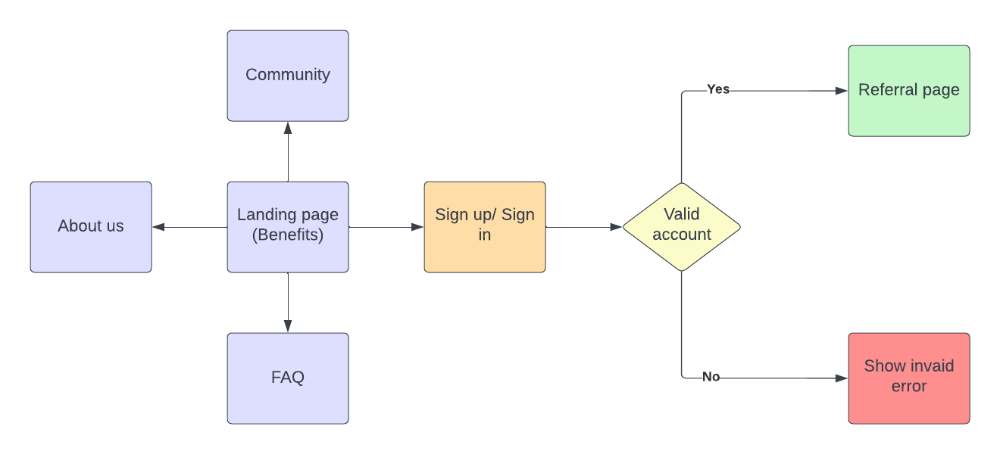

# HOOPA - SHIPCARD
## Workflow

## Tech stacks:
- [HTML5](https://en.wikipedia.org/wiki/HTML5):  is also a candidate for cross-platform mobile applications because it includes features designed with low-powered devices in mind
- [CSS3](https://www.techopedia.com/definition/28243/cascading-style-sheets-level-3-css3#:~:text=Cascading%20Style%20Sheets%20Level%203%20(CSS3)%20is%20the%20iteration%20of,easier%20to%20learn%20and%20understand.): is separated into separate modules to facilitate development. This means that the specification comes out in chunks, with more stable modules than others.
- [Astro](https://astro.build/): an all-in-one web framework for building fast, content-focused websites
- [React](https://reactjs.org/): A JavaScript library for building user interfaces
- [Typescript](https://www.typescriptlang.org/): adds additional syntax to JavaScript to support a tighter integration with your editor. Catch errors early in your editor

## Develop tools:
- [Husky](https://www.npmjs.com/package/husky): improves your commits and run some commands before pushing/committing
- [eslint](https://eslint.org/): Analyzes your code to quickly find problems. It is built into most text editors and you can run ESLint as part of your continuous integration pipeline
- [prettier](https://prettier.io/): An opinionated code formatter, supports many languages and integrates with most editors
- [commitlint](https://github.com/conventional-changelog/commitlint): checks if your commit messages meet the conventional commit format

## Commands
All commands are run from the root of the project, from a terminal:

| Command                | Action                                             |
| :--------------------- | :------------------------------------------------- |
| `pnpm install`          | Installs dependencies                              |
| `pnpm run dev`          | Starts local dev server at `localhost:3000`        |
| `pnpm run build`        | Build your production site to `./dist/`            |
| `pnpm run preview`      | Preview your build locally, before deploying       |
| `pnpm run astro ...`    | Run CLI commands like `astro add`, `astro preview` |
| `pnpm run astro --help` | Get help using the Astro CLI                       |
